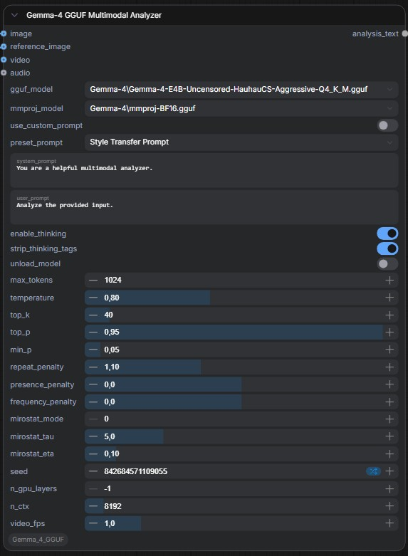

# ComfyUI-Gemma4-GGUF

A ComfyUI custom node for multimodal analysis using **Gemma-4-E4B-it** (GGUF) via `llama-cpp-python`. Supports text, image, video (≤ 30 s). Includes built-in system prompt presets for **reverse-engineered image prompting** and **style transfer**, plus an optional reference image input for two-image workflows.



## Installation

1. Clone or copy this folder into your ComfyUI `custom_nodes/` directory:

   ```
   ComfyUI/custom_nodes/ComfyUI-Gemma4-GGUF/
   ```

2. Install Python dependencies:

   ```bash
   cd ComfyUI/custom_nodes/ComfyUI-Gemma4-GGUF
   pip install -r requirements.txt
   ```

   > **Important:** `llama-cpp-python` version **0.3.35** or later is **mandatory**. This is the first version that includes the `Gemma4ChatHandler` required by this node. Earlier versions will not work. Install the correct version with:
   >
   > ```bash
   > pip install llama-cpp-python>=0.3.35
   > ```
   >
   > `llama-cpp-python` must be compiled with GPU support for CUDA acceleration. See [llama-cpp-python installation](https://github.com/abetlen/llama-cpp-python#installation) for build instructions.

3. Restart ComfyUI.

## Model Setup

Place **both** files in `ComfyUI/models/LLM/`:

| File | Example |
|------|---------|
| Main model | `gemma-4-E4B-it-Q4_K_M.gguf` |
| Multimodal projector | `mmproj-gemma-4-E4B-it-Q4_K_M.gguf` |

Both the model `.gguf` and its matching `mmproj-*.gguf` **must** be in the same `models/LLM/` folder. The projector is required for all vision, video, and audio capabilities.

Download from: [unsloth/gemma-4-E4B-it-GGUF](https://huggingface.co/unsloth/gemma-4-E4B-it-GGUF)

## Node: Gemma-4 GGUF Multimodal Analyzer

Find the node in the **LLM** category in the ComfyUI node menu.

### Inputs

#### Required

| Parameter | Type | Default | Description |
|-----------|------|---------|-------------|
| `gguf_model` | Dropdown | — | Select the GGUF model from `models/LLM/` |
| `mmproj_model` | Dropdown | — | Select the multimodal projector from `models/LLM/` |
| `use_custom_prompt` | Boolean | `True` | Toggle between the custom `system_prompt` text field and the built-in `preset_prompt` dropdown. When **enabled**, your custom text is used; when **disabled**, the selected preset is used. |
| `preset_prompt` | Dropdown | `"Reverse Engineered Prompt"` | Built-in system prompt preset. Only active when `use_custom_prompt` is **disabled**. Options: `Reverse Engineered Prompt`, `Style Transfer Prompt`. |
| `system_prompt` | String | `"You are a helpful multimodal analyzer."` | Custom system role definition. Only active when `use_custom_prompt` is **enabled**. |
| `user_prompt` | String | `"Analyze the provided input."` | User instruction |
| `enable_thinking` | Boolean | `True` | Enable reasoning / thinking mode |
| `strip_thinking_tags` | Boolean | `True` | Remove `<think>…</think>` from output |
| `unload_model` | Boolean | `False` | Free VRAM/RAM after inference |
| `max_tokens` | Int | `1024` | Maximum output tokens (1–128000) |
| `temperature` | Float | `0.8` | Sampling temperature (0.0–2.0) |
| `top_k` | Int | `40` | Top-K sampling (0–500) |
| `top_p` | Float | `0.95` | Nucleus sampling threshold |
| `min_p` | Float | `0.05` | Minimum probability filter |
| `repeat_penalty` | Float | `1.1` | Repetition penalty |
| `presence_penalty` | Float | `0.0` | Presence penalty |
| `frequency_penalty` | Float | `0.0` | Frequency penalty |
| `mirostat_mode` | Int | `0` | Mirostat mode (0=off, 1=v1, 2=v2) |
| `mirostat_tau` | Float | `5.0` | Mirostat target entropy |
| `mirostat_eta` | Float | `0.1` | Mirostat learning rate |
| `seed` | Int | `-1` | RNG seed (-1 = random) |
| `n_gpu_layers` | Int | `-1` | GPU layer count (-1 = all) |
| `n_ctx` | Int | `8192` | Context window (512–131072) |
| `video_fps` | Float | `1.0` | Video temporal sampling rate (0.1–5.0 FPS) |

#### Optional

| Input | Type | Description |
|-------|------|-------------|
| `image` | IMAGE | Single image or batch `[N, H, W, 3]` — serves as the **input image** (content source) |
| `reference_image` | IMAGE | Reference image for **style transfer** workflows. When connected alongside `image`, both are labeled for the model to distinguish (`Input Image` vs `Reference Image`). |
| `video` | IMAGE | Video as frame batch `[F, H, W, 3]` |
| `audio` | AUDIO | Audio dict `{waveform, sample_rate}` |

### Output

| Output | Type | Description |
|--------|------|-------------|
| `analysis_text` | STRING | Generated analysis text |

## Thinking Mode

When `enable_thinking` is **True**, the model performs internal reasoning before answering. This produces `<think>…</think>` blocks. Use `strip_thinking_tags` to control whether these appear in the output.

When thinking is **disabled**, temperature is auto-adjusted to 0.7 and presence_penalty to 1.5 (if left at defaults) to prevent repetitive output.

## System Prompt Presets

The node ships with two built-in system prompt presets, selectable via the `preset_prompt` dropdown when `use_custom_prompt` is **disabled**:

| Preset | Purpose |
|--------|---------|
| **Reverse Engineered Prompt** | Analyzes a single image and generates a detailed natural-language prompt (120–300 words) that enables an image generation model to faithfully recreate the source image. Covers style, subject, composition, lighting, color palette, and additional details. |
| **Style Transfer Prompt** | Analyzes two images — an **input image** (content) and a **reference image** (style) — and generates a prompt that recreates the input image's subjects rendered in the reference image's visual style, lighting, and mood. Requires both `image` and `reference_image` to be connected. |

The `use_custom_prompt` toggle acts as a safeguard: when **enabled**, the custom `system_prompt` text field is used and the presets are ignored; when **disabled**, the selected preset is used and the custom text field is ignored.

## Memory Management

Set `unload_model` to **True** to aggressively free VRAM after each inference. This is recommended when running alongside diffusion models on GPUs with ≤ 16 GB VRAM. The trade-off is a 2–8 second reload time on subsequent runs.

## License

MIT
